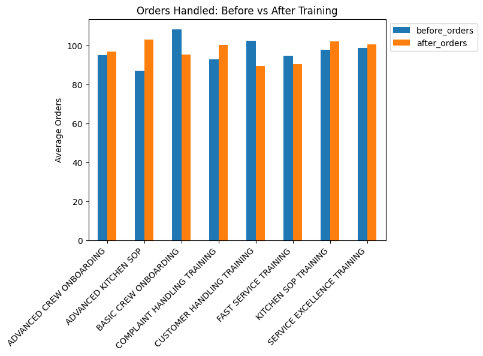
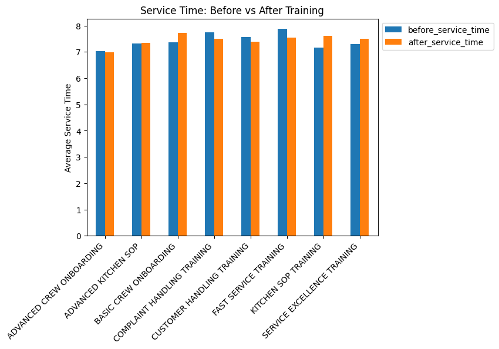
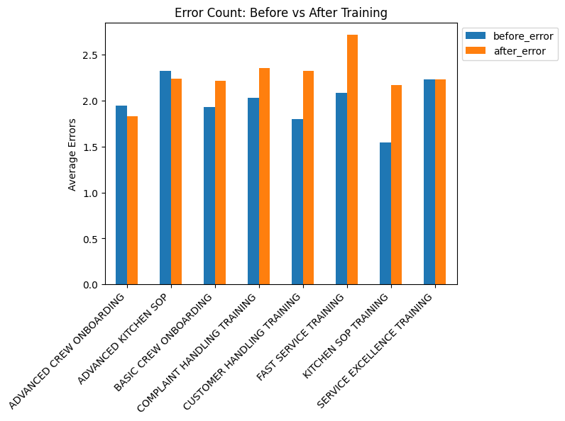
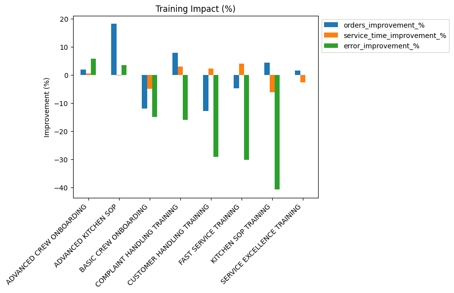
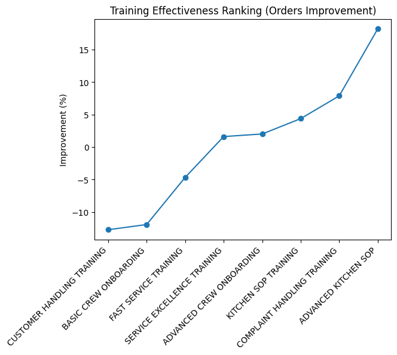

# Training Impact Analysis
## Overview

This project analyzes the impact of employee training programs on performance metrics using a data warehouse approach. The goal is to measure whether training improves productivity, efficiency, and quality of work.

The analysis is based on comparing employee performance before and after training sessions.

---

## Objectives

- Evaluate the effectiveness of training programs
- Measure changes in key performance indicators:
  - Orders handled (productivity)
  - Service time (efficiency)
  - Error count (quality)
- Provide data-driven insights for business decision making

---

## Data Architecture

The project follows a structured data pipeline:

Source Data → Raw Layer → Staging Layer → Data Warehouse (Fact & Dimension)

### Tables Used

**Fact Tables**
- fact_training
- fact_performance

**Dimension Tables**
- dim_training
- dim_employees
- dim_outlets

---

## Methodology

### 1. Data Transformation

Performance data is analyzed within a time window:

- 7 days before training
- 7 days after training

SQL aggregation is used to calculate average performance metrics:

- before_orders vs after_orders
- before_service_time vs after_service_time
- before_error vs after_error

---

### 2. Key Metrics

| Metric | Description |
|------|------------|
| Orders Handled | Number of orders processed by employees |
| Service Time | Average time to serve customers |
| Error Count | Number of errors during operations |

---

### 3. Improvement Calculation

Improvement is calculated using:

- Orders: (After - Before) / Before
- Service Time: (Before - After) / Before
- Error Count: (Before - After) / Before

---

## Visualizations

### 1. Orders Before vs After Training



### 2. Service Time Before vs After Training



### 3. Error Count Before vs After Training



### 4. Training Impact (%)



### 5. Training Effectiveness



---

## Time-Based Analysis

A trend analysis is performed using:

- Day -7 to Day +7 relative to training date

This helps visualize how performance evolves over time rather than only comparing averages.

---

## Key Insights

- Several training programs significantly improved productivity (increase in orders handled)
- Service time decreased after training, indicating improved efficiency
- Error count showed strong reduction in multiple training types, indicating better quality
- Some training programs show trade-offs between speed and accuracy

---

## Tools and Technologies

- SQL (MySQL)
- Python (Pandas, Matplotlib)
- Jupyter Notebook

---

## Project Structure
```
project-folder/
│
├── data/
├── sql/
│   ├── database_preparation.sql
│   ├── staging.sql
│   ├── data_warehouse.sql
│   └── data_exploration.sql
│
├── notebook/
│   └── visualisasi.ipynb
│
├── images/
│   ├── orders.png
│   ├── service_time.png
│   ├── error.png
│   ├── improvement.png
│   └── training_effectiveness.png
│
└── README.md
```

---

## Conclusion

This project demonstrates how data warehouse modeling and SQL-based analysis can be used to evaluate business processes and generate actionable insights.

The results show that training programs can have measurable impacts on employee performance, particularly in reducing errors and improving efficiency.

---

## Author

Bayu Chandra Putra | Data Analyst | Data Visualization | Master's in Computer Science

LinkedIn: www.linkedin.com/in/bayuchandraputra
